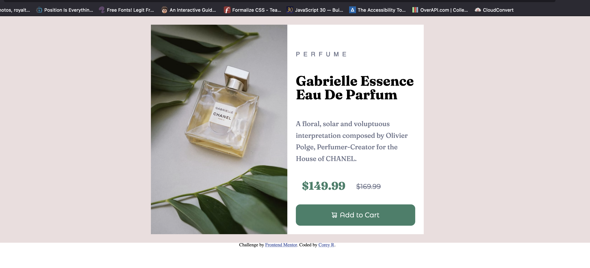
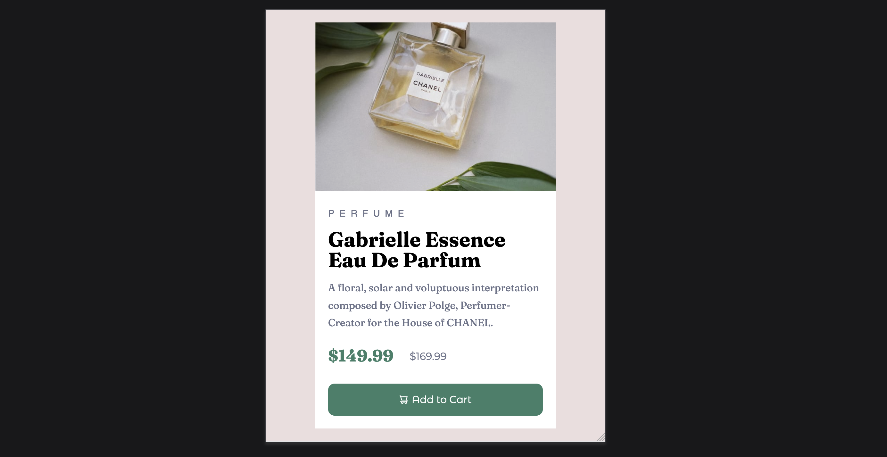
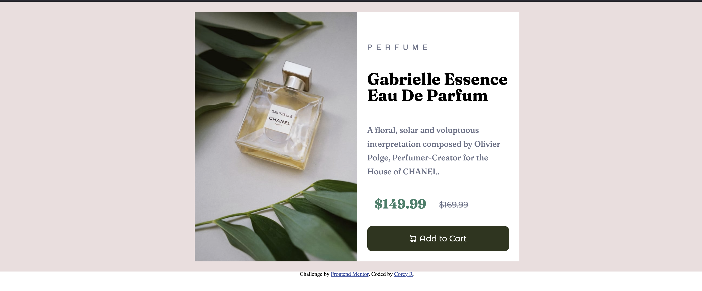

# Frontend Mentor - Product preview card component solution

This is a solution to the [Product preview card component challenge on Frontend Mentor](https://www.frontendmentor.io/challenges/product-preview-card-component-GO7UmttRfa). Frontend Mentor challenges help you improve your coding skills by building realistic projects. 

## Table of contents

- [Overview](#overview)
  - [The challenge](#the-challenge)
  - [Screenshot](#screenshot)
  - [Links](#links)
- [My process](#my-process)
  - [Built with](#built-with)
  - [What I learned](#what-i-learned)
  - [Continued development](#continued-development)
  - [Useful resources](#useful-resources)
- [Author](#author)


**Note: Delete this note and update the table of contents based on what sections you keep.**

## Overview

### The challenge

Users should be able to:

- View the optimal layout depending on their device's screen size
- See hover and focus states for interactive elements

### Screenshot




### Links

- Solution URL: [Add solution URL here](https://your-solution-url.com)
- Live Site URL: [Add live site URL here](https://your-live-site-url.com)

## My process
- my process towards this challenge is a little different from the normal process of mobile first. I did the desktop version first and then challenge the mobile aspect. What I learn alon this process is that mobile first would've made this challenge easier and less headache than creating the desktop version adn then work on the mobile version.

### Built with
- Semantic HTML5 markup
- Flexbox

**Note: These are just examples. Delete this note and replace the list above with your own choices**

### What I learned

I learn a lot of thing from while working on this project. I understand flexbox a lot more right now because I had to learn the difference between the parent container and the child. I learn the difference between rem and em. How they work and the reason for why I should use these units over px. Another thing I learn in the making is that not every browser handle things the same. I know this is inevitable and most developers should know this but after playing around with Chrome dev tools and accidently clicked on Firefox dev tools I'll no longer only look at my work through just chrome. 

I attached a few code snippest below from my CSS and Html file to point out a few new tricks that I learn while creating this project. 

To see how you can add code snippets, see below:

The code below shows a image containter with two image. I learn that there is not a one way correct all in coding and I could've done this another way by using css background image property. 

In this container I put two seperate image. I know for the mobile size I could find a way to hide one of the image and bring the image forward so for the first time I use the hiden attibute to completly hide an image and then use css to display the image. 
```html
<div class="img-container">
        
        
      </div>
```

However even by hiding the image the render was still avialble and showing up on the project in the firefox browswer so I then learn that I can simply use ```display: none``` to completly hide the render as well.

### Continued development
As for thing I want to continue to learn and graps a little better flexbox is at the top of the list. I know its not as complication but I'm still having a slight issue with ```align-content``` and ```align-items``` I want to learn grid as well so I can input grid into some areas of my code and also build more mobile first things where I can watch the responsiveness change as the screen size change. 

### Useful resources
- [MDN Web Docs](https://developer.mozilla.org/en-US/) - Most people sleep on MDN but this resource helped me out so much I think I'm obsessed with this platform.


## Author
- Frontend Mentor - [@dellannie](https://www.frontendmentor.io/profile/dellannie)
- Twitter - [@whatzupcorey](https://www.twitter.com/whatzupcorey)
